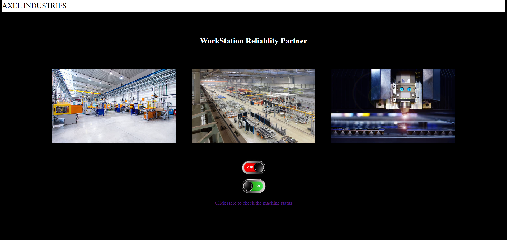
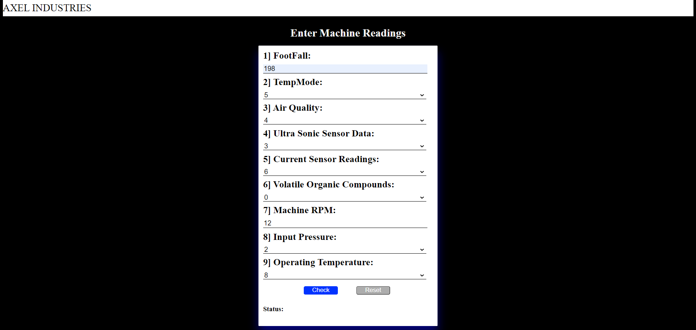
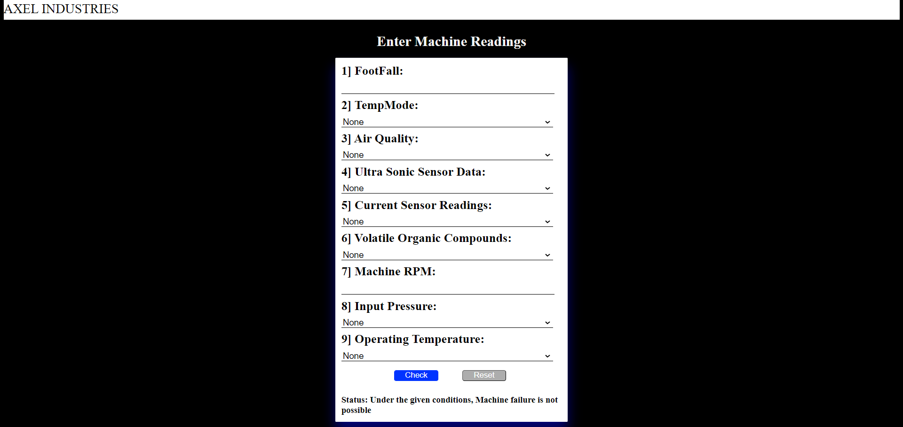

# Machine-Failure-Classification

## Description:
Dataset collected from sensor of various machines with the aim of predicting machine failures in advance. It includes sensor readings such as Air Quality near the machine, electric current usage of the machine, operating temperature of the machine, input pressure on the machine and others.

## Models Used:
* SVC
* Decission Tree
* Ensemble

## Technologies Used:
* Python
* Colab
* Flask
* HTML CSS
* Machine Learning

## Deployment:
Render: https://machine-failure-status.onrender.com

## Result:
* Home Page:
  
* Prediction Page:
  
* Final Output
  
